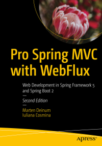

= Apress Source Code

This repository accompanies   https://www.apress.com/us/book/9781484256657[Pro Spring MVC with WebFlux] by Marten Deinum and Iuliana Cosmina (Apress, 2020).

Download the files as a zip using the green button, or clone the repository to your machine using Git.

== Building and Deploying

This project has been configured to support Gradle wrapper usage as well. All the gradle commands mentioned, can be executed using gradle wrapper.
For example - build can be done as `./gradlew build`

The project is build with JDK 14 sucessfully. Gradle version used is 6.X.

This is a Gradle multi-module project. Build the full project using:
----
gradle clean build
----

To use cached builds execute:
----
gradle --build-cache clean build assemble
----

To build the project  and scan your build execute:
----
gradle clean build --scan
----
Just keep in mind, the project is quite big and when displaying the results, you browser might be slow.

=== Trouble shooting

When running `gradle clean build` if you see the following error:

----
gradle clean build
> Task :bookstore-mvc-shared:compileJava FAILED

FAILURE: Build failed with an exception.

* What went wrong:
Execution failed for task ':bookstore-mvc-shared:compileJava'.
> Could not create service of type DefaultGeneralCompileCaches using GradleScopeCompileServices.createGeneralCompileCaches().
   > Cannot lock Java compile cache (/[workspace]/spring-mvc-and-webflux/.gradle/6.7-20200804220106+0000/javaCompile) as it has already been locked by this process.
----
Get rid of it by executing:
----
find ~/.gradle -type f -name "*.lock" -delete
----

== Releases

Release v1.0 corresponds to the code in the published book, without corrections or updates.

== Contributions

See the file `Contributing.adoc` for more information on how you can contribute to this repository.